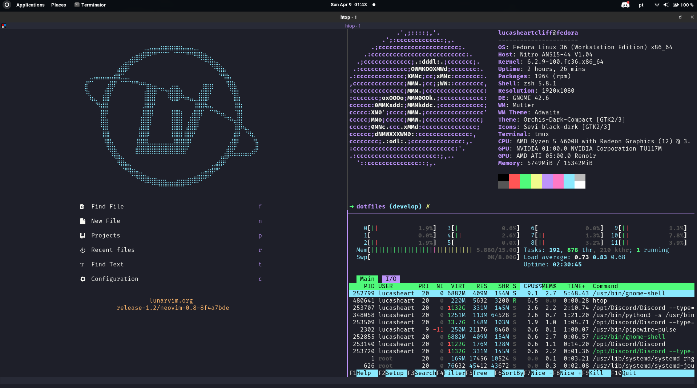

# Dotfiles

Modern, declarative dotfiles configuration using Nix Home Manager and Fish shell.



## ⚠️ Important Notice

**Don't blindly use these settings!** Review and customize them for your needs. This configuration:

- Sets Fish as the default shell
- Manages packages via Nix/Home Manager
- Backs up existing configs before making changes
- Requires Nix package manager installation

## 📦 What's Included

### Development Tools

- **Neovim** - Modern Vim-based text editor with LSP support
- **Git** - Version control with delta diff viewer and lazygit TUI
- **Tmux** - Terminal multiplexer with vim-style keybindings
- **Fish Shell** - User-friendly shell with autosuggestions and syntax highlighting
- **FZF** - Fuzzy finder for files and command history

### Programming Languages & Tools

- Node.js, Yarn - JavaScript/TypeScript development
- Python (pyenv) - Python version management
- Docker & Docker Compose - Container management

### Utilities

- **lsd** - Modern ls replacement with icons
- **ripgrep** - Fast text search tool
- **bat** - Cat clone with syntax highlighting
- **Kitty** - GPU-accelerated terminal emulator
- **Starship** - Cross-shell prompt
- **direnv** - Directory-based environment management

### Editors & Browsers

- VS Code
- Brave Browser

### Fonts

- FiraCode Nerd Font - Ligatures for programming

## 🚀 Quick Start

### Prerequisites

- **Sudo access** - Some system packages require root
- **Git** - To clone this repository
- **Internet connection** - Downloads Nix and packages

### Recommended Installation (Nix/Home Manager)

This is the primary installation method that provides:

- ✅ Declarative configuration
- ✅ Automatic dependency management
- ✅ Easy rollback to previous states
- ✅ Reproducible environments
- ✅ No manual version management

#### Ubuntu

```bash
git clone https://github.com/lucasheartcliff/dotfiles.git ~/.dotfiles
cd ~/.dotfiles
./ubuntu.sh
```

#### Fedora

```bash
git clone https://github.com/lucasheartcliff/dotfiles.git ~/.dotfiles
cd ~/.dotfiles
./fedora.sh
```

The OS-specific script will:

1. Install system dependencies (build tools, libraries)
2. Call `bootstrap.sh` which:
   - Installs Nix package manager
   - Installs Home Manager
   - Applies the configuration from `home-manager/.config/home-manager/home.nix`
   - Sets Fish as default shell
   - Runs `stow-config.sh` for additional dotfiles

### Manual Installation (Without Nix)

If you prefer not to use Nix, you can manually install tools and use stow:

```bash
# Install prerequisites manually (git, stow, etc.)
# Then:
git clone https://github.com/lucasheartcliff/dotfiles.git ~/.dotfiles
cd ~/.dotfiles
./stow-config.sh
```

**Note**: You'll need to manually install all tools listed in `home-manager/.config/home-manager/home.nix`.

## 📝 Post-Installation

### 1. Configure Git User

Edit `~/.config/home-manager/home.nix` and update:

```nix
programs.git = {
  userName = "Your Name";
  userEmail = "your.email@example.com";  # Change this!
  # ...
};
```

Then apply changes:

```bash
home-manager switch
```

### 2. Activate Fish Shell

Log out and log back in for Fish to become your default shell, or run:

```bash
exec fish
```

### 3. Customize Configuration

All Nix packages and configurations are in:

- `~/.config/home-manager/home.nix` - Main configuration
- Individual app configs are in their respective directories (neovim/, tmux/, zsh/, etc.)

After editing, apply changes with:

```bash
home-manager switch
```

## 🛠️ Configuration Structure

```
dotfiles/
├── bootstrap.sh          # Main setup script (installs Nix + Home Manager)
├── stow-config.sh        # GNU Stow configuration linker
├── fedora.sh             # Fedora system packages
├── ubuntu.sh             # Ubuntu system packages
├── home-manager/         # Nix Home Manager configuration
│   └── .config/
│       └── home-manager/
│           └── home.nix  # Main Nix configuration file
├── neovim/               # Neovim configuration
│   └── .config/nvim/     # (stowed to ~/.config/nvim)
├── tmux/                 # Tmux configuration
├── zsh/                  # ZSH configuration (legacy)
├── kitty/                # Kitty terminal config
└── tools/                # Archived manual installation scripts
```

## 🐟 Fish Shell

Fish is configured with:

- **No greeting** - Clean terminal start
- **Abbreviations** - Short aliases that expand (e.g., `g` → `git`)
- **FZF integration** - Fuzzy find files and history
- **Starship prompt** - Beautiful, informative prompt
- **Syntax highlighting** - Built-in command validation
- **Autosuggestions** - Command history suggestions

### Common Abbreviations

```fish
g    → git
ga   → git add
gc   → git commit
gp   → git push
gl   → git pull
glg  → lazygit

v    → nvim
ll   → lsd -l
la   → lsd -la

d    → docker
dc   → docker-compose
```

## 📋 Neovim Configuration

The Neovim config has been updated for compatibility with Neovim 0.10+:

- ✅ Fixed `vim.loop` → `vim.uv` deprecations
- ✅ Updated inlay hints API
- ✅ Resolved null-ls → none-ls migration
- ✅ Fixed duplicate keybindings (`gd` for definition, `gD` for declaration)
- ✅ Dynamic config paths (no hardcoded `~/.config`)
- ✅ Cleaned up commented code

## 🔄 Updating

### Update Home Manager Configuration

```bash
cd ~/.dotfiles
git pull
home-manager switch
```

### Update Nix Channels

```bash
nix-channel --update
home-manager switch
```

### Rollback Changes

If something breaks, rollback to previous generation:

```bash
home-manager generations  # List generations
home-manager switch --rollback  # Rollback to previous
```

## 🐛 Troubleshooting

### Fish is not my default shell

```bash
# Add fish to /etc/shells if needed
echo $(which fish) | sudo tee -a /etc/shells

# Change shell
chsh -s $(which fish)

# Log out and back in
```

### Home Manager command not found

```bash
# Source Nix profile
. /nix/var/nix/profiles/default/etc/profile.d/nix-daemon.sh

# Or add to your shell rc file
```

### Stow conflicts

```bash
# Remove conflicting files/dirs
rm ~/.config/nvim  # or mv to backup

# Re-run stow
cd ~/.dotfiles
./stow-config.sh
```

### Neovim errors after update

Common fixes:

1. Update plugins: Open nvim and run `:Lazy sync`
2. Clear cache: `rm -rf ~/.local/share/nvim ~/.local/state/nvim`
3. Rebuild: `home-manager switch`

### Missing fonts

```bash
# Refresh font cache
fc-cache -fv

# Verify FiraCode installation
fc-list | grep -i fira
```

## 📦 Architecture Support

- **x86_64** - Fully supported
- **ARM64** - Nix handles architecture automatically
- **Other** - May require package availability checks

## 🧪 Testing Before Applying

```bash
# Dry run to see what changes
home-manager switch --dry-run

# Build without switching
home-manager build
```

## 📚 Additional Resources

- [Home Manager Manual](https://nix-community.github.io/home-manager/)
- [Nix Package Search](https://search.nixos.org/packages)
- [Fish Shell Documentation](https://fishshell.com/docs/current/)
- [Neovim Documentation](https://neovim.io/doc/)

## 🤝 Contributing

Feel free to fork and customize! If you find improvements:

1. Fork the repository
2. Create a feature branch
3. Submit a pull request

## 📄 License

These dotfiles are provided as-is for educational purposes. Use at your own risk.

---

**Note**: The `tools/` directory contains archived manual installation scripts. These are kept for reference but are no longer the recommended installation method.
