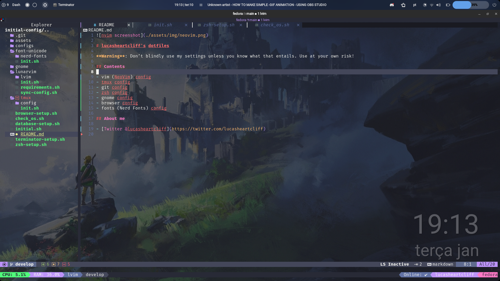
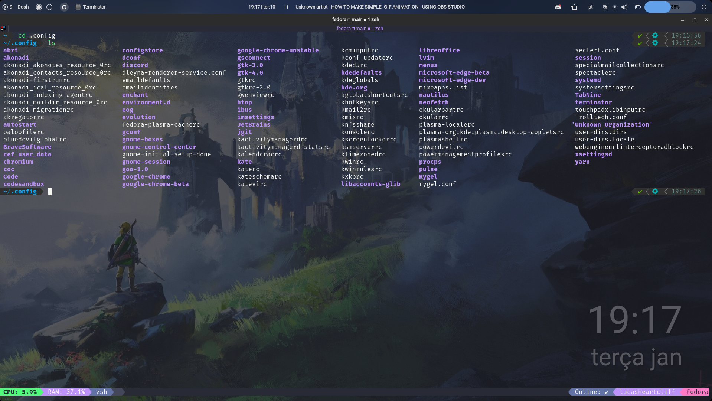

# lucasheartcliff's dotfiles

**Warning**: Don’t blindly use my settings unless you know what that entails. Use at your own risk!

## Contents

- vim (NeoVim) config
- tmux config
- zsh config
- gnome config
- browser config
- fonts (Nerd Fonts) config

